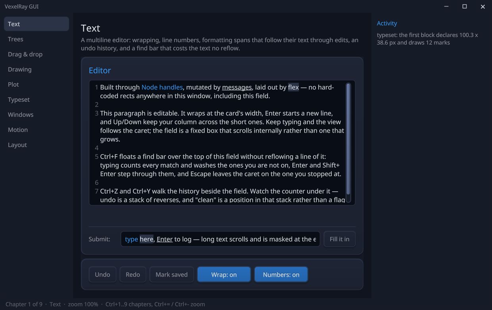

<p align="center">
  
</p>

# vexelray-gui

A retained-mode GUI framework for the VexelRay engine. Declarative trees, flex layout, relative
units, live mutation from any thread — rendered as **one batched draw of one SDF uber-shader**,
shadows, lighting, and text included.

<p align="center">
  
</p>

It is the top of a three-sibling stack, each its own repo:

| Repo | Role |
| --- | --- |
| **[vexelray](https://github.com/sibarum/vexelray)** | Pixels: Vulkan runtime, the 2D `Canvas`, MSDF text, the SDF uber-shader (pre-compiled to SPIR-V at build time via [SupirVast](https://github.com/sibarum/supirvast)) |
| **[tactroller](https://github.com/sibarum/tactroller)** | Input: keyboard/pointer/clipboard middleware — *every* device event flows through it |
| **[atchung](https://github.com/sibarum/atchung)** | Messages: the typed bus that carries input in and mutations through |

The GUI's job is what sits above pixels and wire: **identity, layout, dispatch, motion**
([docs/architecture.md](docs/architecture.md) is the deep version of this document).

## Building

The siblings install to the local Maven repo, in dependency order:

```bash
cd ../supirvast   && mvn install
cd ../vexelray    && mvn install
cd ../tactroller  && mvn install    # and atchung, if not pulled in transitively
cd ../vexelray-gui && mvn install
```

Run the interactive showcase (needs a Vulkan-capable GPU):

```bash
mvn -pl vexelray-gui-demo -am compile exec:exec
```

Headless capture to PNG (works in CI, no input backend needed):

```bash
mvn -pl vexelray-gui-demo exec:exec -Ddemo.args=--capture
```

Native executable (needs a GraalVM JDK; profile-gated so ordinary builds stay fast):

```bash
mvn -Pnative -pl vexelray-gui-demo -am package   # -> target/vexelray-demo(.exe)
```

## The mental model

Three rules explain almost everything:

1. **Handles are write-only and thread-safe.** A `Node` is a stable identity, not the node itself.
   Every setter posts a mutation onto the bus; the GUI thread applies it. You can hold a handle
   forever and mutate from any thread — that is the normal way, not the exception.
2. **The GUI thread is the main thread; app logic is not.** Handlers (`onClick`, `onChange`, …)
   run on worker threads and talk back through handles. Vulkan, the window, and presentation stay
   on main.
3. **Layout owns geometry.** Everything is a `Length` resolved by the flex pass; the renderer is a
   pure consumer of resolved pixels. Reads come from a published snapshot (`node.layout()`), one
   frame stale by design.

## Building a UI

```java
Gui gui = new Gui();

Node title = gui.text("Hello").textSize(Length.rem(1.75f)).textColor(Color.rgb(0xeef2f8));

Node card = gui.column()
        .width(Length.FILL).height(Length.FILL)
        .background(Color.rgb(0x1b2130))
        .corner(Length.rem(1))
        .border(Length.rem(0.1f), Color.rgb(0x2b3346))
        .lit(true)                          // SDF edge light + vertical gradient
        .elevation(Length.rem(1.25f))       // analytic soft shadow underneath
        .padding(Length.dp(20)).gap(Length.rem(0.625f))
        .children(title);

gui.root().background(Color.rgb(0x11141b)).children(card);
```

**Containers**: `gui.row()`, `gui.column()`, `gui.box()`, `gui.text(s)`; compose with
`.children(...)`, mutate structure later with `append`/`visible(false)` (hiding keeps identity,
handlers, and widget state — the right tool for tab pages and anything shown one-at-a-time).

**Lengths**: `rem`/`em` (type-relative — these zoom), `dp` (density-independent frame — gutters
and chrome that should *not* zoom), `percent`, `vw`/`vh`, `grow(f)` (flex weight), `FILL`, `AUTO`
(size to content). Corner radius, border, elevation, and text size are all `Length`s, so the whole
UI scales coherently: `gui.zoomRange(0.5f, 3f, 1.25f)` plus `gui.zoomIn/zoomOut/resetZoom`.

## Depth and light

Every visual effect is a transfer function over the one rounded-box SDF the renderer already
evaluates — no textures, no extra passes, still one draw:

| Prop | Effect |
| --- | --- |
| `.elevation(Length)` | Soft drop shadow under the background; animate it per interaction state (the demo's buttons lift on hover and set down flush while pressed) |
| `.lit(true)` | Edge light from the global top-left light + a faint vertical luminance gradient — modulates whatever `background` is set to, so state restyles keep working |
| `.textSunken(true)` | Letterpress text: shade above the glyphs, glint below, crisp fill — for white-on-accent labels |
| `.corner(top, bottom)` | Independent corner radii per vertical half — a tab is `corner(r, Length.ZERO)` |

The design rule that produced these (and deleted one that didn't fit): effects must compose against
the **global light**, not accumulate as geometry decorations. Multi-pass effects (backdrop blur,
bloom) are deliberately out of scope for the single-pass batch.

## Interaction

Input arrives tactroller → atchung → the framework's dispatch; you subscribe by node:

```java
gui.onClick(button, () -> log.append(gui.text("clicked")));       // worker thread
gui.onContextClick(row, e -> menu.show(e.x(), e.y()));            // right-click, with the pointer position
gui.onState(button, state -> button.background(colorFor(state))); // NORMAL / HOVER / PRESSED (observers add up)
gui.onDrag(slider, e -> set(e.fractionX()));                      // pointer-captured
gui.shortcut(Key.EQUAL, gui::zoomIn, Modifier.CONTROL);           // global chords
gui.claim(node, Shortcut.of(Key.LEFT), ClaimScope.FOCUSED, cmd);  // focused-only chords
```

Clickable nodes get the pointer cursor by inference; register `gui.cursor(node, shape)` only when
the affordance can't be inferred (a slider wants GRAB). Focus is `gui.focusable(node, true)` +
`gui.focus(node)`; Tab order and focused-scope claims come with it.

**Threading**: `gui.async(work)` runs app logic off the GUI thread; `gui.batch(edits)` groups
mutations into one frame. Install the OS clipboard with `gui.clipboard(...)` (see the demo — the
in-memory default keeps headless runs working).

## Widgets (`vexelray-gui-widget`)

Widgets are ordinary framework users — built entirely on public `Node`/`Gui` API:

- **`TextField`** — single or `multiline(true)` editing: word wrap, line numbers, caret-follow
  scroll, selection, cut/copy/paste, sticky-column Up/Down, `onSubmit`. Formatting `Span`s
  (fg/bg/underline over character ranges) auto-remap through every edit — set them once, they
  follow their text.
- **`Slider`** — a dragged track with a lit, elevated thumb; `value()`/`onChange`.
- **`Tabs`** — headers over a page stack. Pages are hidden, never removed, so switching away and
  back returns the page exactly as it was — caret and all. Arrow keys walk the bar while a header
  has focus; the active tab floats forward (lit + elevated, rounded shoulders, flat seat).
- **`TreeView<T>`** — a generic explorer for hierarchical data (a filesystem, an AST) over a
  four-method `Source<T>`. Children fetch lazily off the frame loop, exactly once per item;
  collapse hides the subtree rather than discarding it; one tab stop drives the whole tree
  (Up/Down/Left/Right/Home/End/PageUp/PageDown/Enter).
- **`ContextMenu`** — commands at the pointer, built on two core primitives: right-click dispatch
  (`gui.onContextClick`) and floating placement (`Node.floatAt` — an out-of-flow last child of the
  root paints over the page and is hit first: the overlay primitive). Escape and click-away
  dismiss; opening reflows nothing; an edge open slides on-screen.
- **`TitleBar`** — the window's own chrome as ordinary widgets: a draggable strip, a title, and
  minimize/maximize/close buttons. Two declarations do the work — the strip is `WindowRegion.DRAG`,
  each button punches an `INTERACTIVE` hole in it — so the window manager still moves, snaps and
  maximizes the window while the clicks reach the buttons. The maximize icon is re-derived from the
  window on every viewport change, because Win+Up and a caption double-click change it too.
- **`Tooltip`** — hover help that is admissible under the hover rule by construction: the bubble is
  `hitInert` (drawn, never a pointer target), anchored to the control's box (never follows the
  pointer), and coexists with the control's own hover restyle because state observers accumulate.

The demo ([Demo.java](vexelray-gui-demo/src/main/java/dev/vexelray/gui/demo/Demo.java)) exercises
all of it end to end — worth reading top to bottom as the canonical example.

## The application edge

What sits between the GUI and the OS, all driven from the one main-thread loop:

- **Windows** — `GuiApp(WindowConfig)` creates the main window (at persisted bounds, if you pass
  them); `requestPopup(...)` is callable from any thread and materialises a true OS window into
  the shared frame loop. Popups are **owned** by the main window: one taskbar icon for the whole
  application, always above the main window, raised and minimized together with it.
- **Window chrome** — `WindowConfig.decorations(Decorations.CLIENT)` hands the frame to the GUI:
  the client area covers the whole window, so a `TitleBar` draws where the system title bar was.
  The window keeps its overlapped frame, so dragging, snapping, Win+arrow, double-click-to-maximize,
  the system menu and the maximize clamp to the work area stay the window manager's. What the GUI
  supplies is geometry, not behaviour: nodes declare `WindowRegion.DRAG` / `INTERACTIVE` /
  `MAXIMIZE_BUTTON`, the host derives the rectangles from each laid-out frame and pushes them to
  the OS, and the window answers its own hit-test from them. `GuiApp.controls()` is the other half —
  minimize, maximize/restore, close, for the buttons to call.
- **`Settings`** — per-user persistence at `~/.appname/settings.properties`: typed get/put
  (including ordered lists, e.g. the open files), explicit atomic `save()`, and every failure mode
  (missing, malformed, corrupt) degrades to defaults — never an exception at launch. The demo
  round-trips its window bounds through it.
- **Native file dialogs** (`vexelray-gui-nfd`) — open/save/pick-folder as `Optional<Path>`, bound
  straight to the window handle.

## Going deeper

- [docs/architecture.md](docs/architecture.md) — the full design: substrate contracts, the
  retained model, dispatch, the effect system as built
- [docs/layout-read-model.md](docs/layout-read-model.md) — the geometry pipeline and the
  published read-model every consumer (renderer, hit-testing, widgets) shares
- [docs/keyboard-focus-text.md](docs/keyboard-focus-text.md) — keys, focus, claims, and text editing
