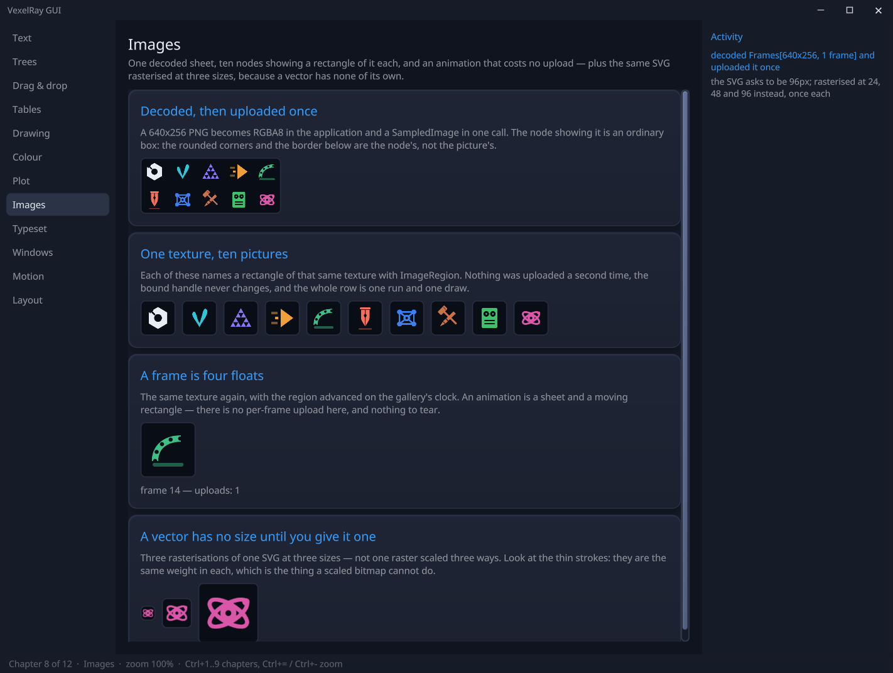

<p align="center">
  
</p>

# vexelray-gui

A retained-mode GUI framework for the VexelRay engine. Declarative trees, flex layout, relative
units, live mutation from any thread — rendered as **one batch of one SDF uber-shader**,
shadows, lighting, and text included. A window showing no images is one draw call; one showing
a ray-marched **viewport** costs a rebind per image and nothing else, because a viewport is a box
that samples rather than a second pipeline.

<p align="center">
  
</p>

It is the top of a three-sibling stack, each its own repo:

| Repo | Role |
| --- | --- |
| **[vexelray](https://github.com/sibarum/vexelray)** | Pixels: Vulkan runtime, the 2D `Canvas`, MSDF text, the SDF uber-shader (pre-compiled to SPIR-V at build time via [SupirVast](https://github.com/sibarum/supirvast)) |
| **[tactroller](https://github.com/sibarum/tactroller)** | Input: keyboard/pointer/clipboard middleware — *every* device event flows through it |
| **[atchung](https://github.com/sibarum/atchung)** | Messages: the typed bus that carries input in and mutations through |

The GUI's job is what sits above pixels and wire: **identity, layout, dispatch, motion**
([docs/architecture.md](docs/architecture.md) is the deep version of this document).

## Building

The siblings install to the local Maven repo, in dependency order:

```bash
cd ../supirvast   && mvn install
cd ../vexelray    && mvn install
cd ../tactroller  && mvn install    # and atchung, if not pulled in transitively
cd ../vexelray-gui && mvn install
```

Run the interactive showcase (needs a Vulkan-capable GPU):

```bash
mvn -pl vexelray-gui-demo -am compile exec:exec
```

Headless capture to PNG (works in CI, no input backend needed). `demo.args` is split on whitespace, so a
filename and a chapter index are ordinary arguments:

```bash
mvn -pl vexelray-gui-demo exec:exec -Ddemo.args=--capture
```

```bash
mvn -pl vexelray-gui-demo exec:exec "-Ddemo.args=--capture tables.png 3"
```

Native executable (needs a GraalVM JDK; profile-gated so ordinary builds stay fast):

```bash
mvn -Pnative -pl vexelray-gui-demo -am package   # -> target/vexelray-demo(.exe)
```

## The mental model

Three rules explain almost everything:

1. **Handles are write-only and thread-safe.** A `Node` is a stable identity, not the node itself.
   Every setter posts a mutation onto the bus; the GUI thread applies it. You can hold a handle
   forever and mutate from any thread — that is the normal way, not the exception.
2. **The GUI thread is the main thread; app logic is not.** Handlers (`onClick`, `onChange`, …)
   run on worker threads and talk back through handles. Vulkan, the window, and presentation stay
   on main.
3. **Layout owns geometry.** Everything is a `Length` resolved by the flex pass; the renderer is a
   pure consumer of resolved pixels. Reads come from a published snapshot (`node.layout()`), one
   frame stale by design.

## Building a UI

```java
Gui gui = new Gui();

Theme theme = gui.theme();          // colour is a role, never a literal (see Theme, below)

Node title = gui.text("Hello").textSize(Length.rem(1.75f)).textColor(theme.color(Role.INK));

Node card = gui.column()
        .width(Length.FILL).height(Length.FILL)
        .background(theme.color(Role.PANEL))
        .corner(Length.rem(1))
        .border(Length.rem(0.1f), theme.color(Role.LINE))
        .lit(true)                          // SDF edge light + vertical gradient
        .elevation(Length.rem(1.25f))       // analytic soft shadow underneath
        .padding(Length.dp(20)).gap(Length.rem(0.625f))
        .children(title);

gui.root().background(theme.color(Role.PAGE)).children(card);
```

**Containers**: `gui.row()`, `gui.column()`, `gui.box()`, `gui.text(s)`; compose with
`.children(...)`, mutate structure later with `append`/`visible(false)` (hiding keeps identity,
handlers, and widget state — the right tool for tab pages and anything shown one-at-a-time).

**There is no separate text node.** `gui.text(s)` is sugar for `gui.box().text(s)`, and a node is a text node
*iff* it carries a string — the kind is a reading of the prop map, never a second copy of the fact. That
matters because the two used to be able to disagree, silently and in one direction: layout and the renderer
believed a stored kind, so `gui.box().text("Volume")` measured at zero height and drew nothing, while the
accessible name believed the property, so the label was still announced to automation and to a screen reader. A
label in every listing and absent from the screen is the worst kind to hunt, and it was one ordinary line away.
An empty string is still text — a value column waiting for a number holds its line's height, so the row does
not jump when the number lands.

**Lengths**: `rem`/`em` (type-relative — these zoom), `dp` (density-independent frame — gutters
and chrome that should *not* zoom), `percent`, `vw`/`vh`, `grow(f)` (flex weight), `FILL`, `AUTO`
(size to content). Corner radius, border, elevation, and text size are all `Length`s, so the whole
UI scales coherently: `gui.zoomRange(0.5f, 3f, 1.25f)` plus `gui.zoomIn/zoomOut/resetZoom`.

## Theme

Colour is a **role**, resolved against the one `Theme` on `Gui` — no widget names a colour:

```java
gui.theme(Theme.LIGHT);                                            // before building; DARK is the default
Node card = gui.box().background(gui.theme().color(Role.PANEL))    // PAGE / CHROME / PANEL / RAISED / WELL / LINE
        .border(Length.rem(0.1f), gui.theme().color(Role.LINE));   // INK / DIM / FAINT / ACCENT / ACTION / DANGER
gui.onState(card, s -> card.background(gui.theme().color(Role.PANEL, s)));   // hover and press are derived
```

A `Palette` is nine authored numbers, not a table of colours: a page, a lightness step, an ink, a
fade, three chromatic anchors, and how depth reads. Surfaces are `n` steps from the page **towards
the ink**, so one set of roles serves a dark and a light theme and a border keeps the same
perceptual contrast in both — the theme never states a direction. Hover and press are one signed
lightness step applied in Oklab to whatever the control already is, which is why there is no
`PANEL_HOVER`. A role is a function (`Role mine = p -> p.surface(3)`), so an application extends the
vocabulary without registering anything, and `PaletteGuardTest` fails the build if any framework
class mints a `Color` of its own.

## Depth and light

Every visual effect is a transfer function over the one rounded-box SDF the renderer already
evaluates — no textures, no extra passes, still one draw:

| Prop | Effect |
| --- | --- |
| `.elevation(Length)` | Soft drop shadow under the background; animate it per interaction state (the demo's buttons lift on hover and set down flush while pressed) |
| `.lit(true)` | Edge light from the global top-left light + a faint vertical luminance gradient — modulates whatever `background` is set to, so state restyles keep working |
| `.textSunken(true)` | Letterpress text: shade above the glyphs, glint below, crisp fill — for a `Role.ON_ACTION` label on a filled control |
| `.corner(top, bottom)` | Independent corner radii per vertical half — a tab is `corner(r, Length.ZERO)` |
| `.opacity(float)` | Fades the node and its whole subtree, multiplying down the tree. A visual transform, never a layout input: nothing reflows, which is what makes it cheap enough to drive every frame. Pair it with `.hitInert(true)` when fading something out from under the pointer — a faded node still occupies its box |
| `.translate(emX, emY)` | Draws the node and its subtree offset, in multiples of its own em, without moving it. The other visual transform: no reflow, no measurement. It still lays out, reports and hit-tests where it was, so pair it with `.hitInert(true)` while it moves and `.clip(true)` on the parent unless it should escape |
| `.clip(true)` | Masks children to this node's border box. Scrolling containers already clip their viewport; say this for one that doesn't scroll but still has an edge — a translated child adds no overflow, so it never trips the automatic kind |

The design rule that produced these (and deleted one that didn't fit): effects must compose against
the **global light**, not accumulate as geometry decorations. Multi-pass effects (backdrop blur,
bloom) are deliberately out of scope for the single-pass batch.

## Interaction

Input arrives tactroller → atchung → the framework's dispatch; you subscribe by node:

```java
gui.onClick(button, () -> log.append(gui.text("clicked")));       // worker thread
gui.onContextClick(row, e -> menu.show(e.x(), e.y()));            // right-click, with the pointer position
gui.onState(button, s -> button.background(gui.theme().color(Role.PANEL, s))); // observers add up
gui.onDrag(slider, e -> set(e.fractionX()));                      // pointer-captured
gui.shortcut(Key.EQUAL, gui::zoomIn, Modifier.CONTROL);           // global chords
gui.claim(node, Shortcut.of(Key.LEFT), ClaimScope.FOCUSED, cmd);  // focused-only chords
```

Clickable nodes get the pointer cursor by inference; register `gui.cursor(node, shape)` only when
the affordance can't be inferred (a slider wants GRAB). Focus is `gui.focusable(node, true)` +
`gui.focus(node)`; Tab order and focused-scope claims come with it.

### Context menus

A menu is not an object you build and keep — it is a question asked at the moment of the right click:

```java
gui.onContextMenu(row, menu -> menu
        .item("Open", () -> open(path))
        .item("Paste", clipboard.hasText(), () -> paste(path))   // shown, greyed when it cannot apply
        .separator()
        .item("Properties", () -> inspect(path)));
```

- **The nearest node with a menu owns the click** — leaf→root, the same rule a click handler follows,
  so a row inside a panel inside a page may each declare one and the innermost answers.
- **Sources accumulate**, like `onState` observers: the widget states its defaults and the
  application adds what only it knows, into one menu, in registration order. Nothing is restated and
  nothing has to agree on an order.
- **A widget can hand its own context to the builder**: `TreeView.onContextMenu((item, menu) -> …)`
  and `Tabs.onContextMenu((index, menu) -> …)` say *which* thing was clicked, which the framework has
  no way to name.
- **Contribute nothing and no menu opens** — "there is nothing to offer here" needs no special case.
- **Defaults ship with the widgets**: a `TextField` offers Copy/Cut/Paste (Copy alone when
  `readOnly(true)`, each greyed when it does not apply), a tab offers Close.

`ContextMenu` draws them; `gui.menus(presenter)` replaces it with something else entirely
(`MenuPresenter`), the same way `gui.clipboard(...)` replaces the clipboard.

**Threading**: `gui.async(work)` runs app logic off the GUI thread; `gui.batch(edits)` groups
mutations into one frame. Install the OS clipboard with `gui.clipboard(...)` (see the demo — the
in-memory default keeps headless runs working).

### Transfer: drag and drop, cut and paste

One mechanism, two ways in — and one invariant: **what the user is shown is what will happen, and
nothing happens that the user was not shown.** Every failure the design exists to prevent breaks one
half of that, and all of them are discovered after letting go, which is the worst moment to discover
anything.

```java
gui.onDragSource(body, (x, y) -> rowAt(y) instanceof Row r ? Payload.of(ROW, r) : null);  // null = nothing here drags
gui.onDrop(body, (payload, x, y) -> payload.as(ROW)                 // asked per frame, for *every* point
        .map(row -> seamAt(y).accept(row))
        .orElse(Drop.NONE));
gui.dropHistory(history);                            // until this is set, drops resolve and draw but commit nothing
```

- **Sources are plural; resolution is singular.** A drag begun by the pointer and a cut carried in
  hand resolve against the same targets, produce the same `Change`, and record in the same undo stack.
  The keyboard route is the pointer route with the position supplied by the selection instead of the
  mouse — which is why `gui.transfer(...)` (what is held for a paste) is one per `Gui` and not the OS
  clipboard: a typed payload has nowhere to ride across a process boundary.
- **The gesture is recognised for you.** A press becomes a drag only once the pointer has travelled
  far enough and held long enough, and the source is asked for a payload at *that* moment, not at the
  press — with the point where the press *landed*, not where the pointer has since wandered.
  Answering null leaves it an ordinary click.
- **A drop target answers for every point, not for the good ones.** That is the stronger obligation
  on purpose: it rules out the drop that works in some places and silently does nothing in others, so
  the user learns to hunt for the spot that "takes". `Drop.NONE` is a legitimate answer — the point is
  that it is an *answer*, chosen, rather than a gap nobody considered. It describes and never acts:
  what is *shown* is what is performed on release, from the same resolution.
- **Refusing is an ordinary answer.** A `Reorder<T>` returns the `Change` that puts an item at a
  `Placement`, or null — dropping a folder inside itself, a read-only branch, a copy of an item that
  cannot be duplicated. Refusing here means the user is told by the indicator *before* releasing
  rather than by nothing happening afterwards.
- **A `Placement` is relative, never an index.** "After Q" survives an edit elsewhere; "under P at
  index 4" does not, and a reorder undone minutes later is not hypothetical.
- **`DropIndicator`** is told *where* and decides only *how* — a bar on a seam, a ring around a box,
  and it can tell the two apart from the rectangle it is handed rather than from a flag beside it that
  could disagree. Replaceable per widget, `DropIndicator.NONE` to draw nothing.

[docs/transfer.md](docs/transfer.md) is the full record.

### Navigation and landmarks

```java
gui.landmark("prefs.theme.accent", swatch);          // a name for a node, not for a route
gui.navigate("prefs.theme.accent");                  // reveal it, scroll it in, give it the keyboard
```

The address names the *node*; the route is derived, every time, from the tree as it stands — so
moving the swatch to a different tab does not break a single link to it. Getting there uses the
commands the widgets already expose (the same `select`, `expand` and `scrollIntoView` a click ends up
calling), so a page arrived at this way is in exactly the state it would be in had the user clicked
their way there. It is deliberately *not* synthesised input: input needs a place on screen to aim at,
and half of what navigation does is make the target have one.

`gui.reveals(node, reveal)` is the seam that lets navigation cross a tab panel, a collapsed branch or
a drawer without knowing what any of those are — the widgets that conceal things register their own,
so an application needs this only for a container it wrote itself. An `Address` may name a window
(`"prefs/theme.accent"`); one naming another window is *published* rather than walked, and `GuiApp`
opens that window if it is closed. `navigate` takes frames rather than returning done, and reports
its arrival through the `Navigation` it hands back. See [docs/navigation.md](docs/navigation.md).

### Undo

```java
gui.history(documentHistory);                        // application-wide: the root, always in force
gui.history(field.node(), field.history(), ClaimScope.FOCUSED);   // and the editor's own, while it has focus
```

Ctrl+Z, Ctrl+Shift+Z and Ctrl+Y, bound to a `History` and claimed at a scope. **Nesting needs nothing
new**: claim precedence already says the specific binding wins while it applies, so Ctrl+Z undoes your
typing while the caret is in a field and the last document command when it is not, with neither
history knowing the other exists. A transfer records into `gui.dropHistory()` whichever way it was
made, so a drop and a paste land in the same stack rather than in two that disagree about what "the
last thing you did" was.

### Reading the tree

Two published read-models, both lock-free snapshots, one frame stale by design. Nothing reads GUI
thread state to get at them, which is what lets a widget, a test, an agent and the renderer share one
answer.

```java
NodeLayout box = node.layout();                      // rect, content rect, scroll, overflow, corner radii, text metrics
gui.onResize(node, computed -> repaint(computed));   // "my geometry is real now" — including the first time
gui.layout();                                        // the whole snapshot, as bus State
gui.semanticSnapshot();                              // what each node *is*: role, name, structure, focus
```

`onResize` is the seam that closes a silent failure mode: geometry used to be observable only by
polling or by diffing the snapshot, so code that ran too early read `NodeLayout.ABSENT`, did nothing,
reported nothing, and was never asked again. It is an observer rather than a one-shot, so the same
registration covers every later resize, zoom and DPI change. `onResizeUi` is the same thing delivered
inside the layout pass that produced it, for work that has to land in the same frame — measure, mutate
a handle, return; anything that computes belongs on the plain one. Only a change of *box* fires it, so
scrolling a container does not. See [docs/layout-read-model.md](docs/layout-read-model.md) and
[docs/semantic-read-model.md](docs/semantic-read-model.md).

## Widgets (`vexelray-gui-widget`)

Widgets are ordinary framework users — built entirely on public `Node`/`Gui` API:

- **`TextField`** — single or `multiline(true)` editing: word wrap, line numbers, caret-follow
  scroll, selection, cut/copy/paste, sticky-column Up/Down, `onSubmit`. Formatting `Span`s
  (fg/bg/underline over character ranges) auto-remap through every edit — set them once, they
  follow their text. `readOnly(true)` closes the *user's* edit channel and keeps the caret, the
  selection and Copy — a field to read out of, which the application still writes to.
- **`Slider`** — a dragged track with a lit, elevated thumb; `value()`/`onChange`.
- **`Toggle`** — a switch, and literally a two-valued slider: two grow-weighted spacers split the free space in
  the ratio `on : (1-on)`, so the knob lands flush at either end at any track width and any DPI, with no pixel
  arithmetic to keep in step with the geometry. The crossing is a `Ramp` — installed or not by the application,
  and with none installed the knob simply appears at the other end, which is both what a switch did before there
  was motion and the whole of the reduced-motion path.
- **`NumberField`** — a `TextField` that only ever hands out a number. **What is on screen and what has been
  agreed are two different things**: `-1.` and a bare `-` are each halfway to a real number, so a field that
  validated per keystroke would make those numbers unreachable by typing them. The text is left alone while it
  is being edited and read only on *commit* (Enter, or focus leaving); until then `value()` answers the last
  agreed number. An unparseable commit puts that number back rather than clearing, so the field always shows a
  number and the user always sees which one they are holding. Arrow keys step it, in `BigDecimal` — a field
  stepped up and down ten times reads what it read before.
- **`Segment<T>`** — a row of mutually exclusive options with all of them on show (`Solid | Additive | SSS`).
  Not a menu, which hides every option but the chosen one and costs a click and a guess to learn what the
  alternatives are; not three switches, whose shape does not forbid turning two on, so the exclusivity lives in
  a handler and the user meets it by being corrected. Options are `(label, value)`, so what comes back out of
  `onChange` is what the application already calls it rather than an index that quietly means something else
  after an insert.
- **`Select<T>`** — the other end of the same choice: one line high whatever the list holds, with the
  alternatives a click away. A closed strip over a floating `ListView`, so a select over ten thousand values
  costs a popup's worth of nodes and opening scrolls to the current one rather than to the top. **Multi-select
  is the mode, not a second widget** — hand it a `SelectionModel.range()` and every difference falls out of that
  one answer, because `lead` degrades to `at` and `toggle` degrades to `at` wherever only one thing may be held,
  so the same call is right in both. While the popup is up it owns Up/Down/Enter/Escape at `ClaimScope.VISIBLE`;
  the claims are taken on opening and given back on closing, since a hidden node keeps its claims. `onCommit`
  fires when a choice is *made*, Escape restores what the popup opened with, and the chevron slot is reserved
  whether or not there is a value, so a longer one moves nothing beside it.
- **`ColorPicker`** — a saturation/value square over hue and alpha ramps, a preview, a hex box and a
  strip of recents. The ramps are `Picture`s rather than subtrees, and the square is banded across
  saturation only: value in HSV is a multiply and the Canvas composites straight alpha, so black at
  coverage `1-v` over the full-value colour *is* the colour at `v` — one strip per row, exact. It
  announces twice for two different events: `onChange` while a drag moves (the live preview) and
  `onCommit` when a colour has been chosen (the undo entry, and what records into the history).
  Steered in `Hsv` rather than `Color`, because grey has no hue to recover.
- **`ColorHistory`** — the recents, most recent first, bounded and de-duplicated at display
  resolution, held as bus `State`. Handed *to* the pickers rather than owned by one, so every picker
  in an application shows the same past.
- **`Inspector` / `Property`** — a panel of settings built from *what they are* rather than from how they look:
  declare the properties, and the labelled rows, the section headings and the value column are a consequence.
  **There is no `Kind` enum and no switch** — a `Property` builds its own editor and the inspector only places
  the node it gets back, which is the whole of what keeps the vocabulary open: five kinds ship (`range`,
  `number`, `flag`, `choice`, `swatches`, over `Slider`, `NumberField`, `Toggle` and `Segment`), and a sixth is
  an application class handed over without this module being touched. It is the same shape `plot`'s `Expr`
  takes, for the same reason. Two consequences worth stating: the **value column belongs to the inspector**, not
  to the row — it is reserved for every row and handed to the property as a `Readout`, because a column that
  appeared only where there was something to put in it would move the controls beside it as values came and
  went; and factories take a **supplier and a consumer, not a value and a callback**, so the model stays the
  truth and `refresh()` re-reads it after a preset, a keystroke or a fit changed it elsewhere. Sections are
  declared, never sorted: the order on screen is the order in the source. `card(...)` is the other shape — a
  heading with a switch and a badge over a body of rows that folds away — which is here rather than in an
  application because a layer list is the same thing every time. `motion(ramp)` gives the knobs of the switches
  the panel builds itself — a card head's, a `flag` row's — their time, offered to every row the same way the
  `Readout` is (`Property.motion`, default: ignore it), so a row with nothing to animate is not asked to have
  any and a panel says it once rather than per row.
- **`Tabs`** — headers over a page stack. Pages are hidden, never removed, so switching away and
  back returns the page exactly as it was — caret and all. Arrow keys walk the bar while a header
  has focus; the active tab floats forward (lit + elevated, rounded shoulders, flat seat).
- **`Rail`** — a column of icons choosing which panel is on show, and the panel beside it. **Not `Tabs` turned
  on its side**: a tab bar asks *which of these documents am I looking at*, so one is always selected; a rail
  asks *which tool am I holding*, so **none** is a legitimate answer and clicking the selected icon puts the
  panel away. That state is the reason it is its own widget rather than an orientation flag on the other one —
  the work is the canvas, and the panel is on loan from it. Pages are builders, built the first time they are
  shown and kept thereafter (a rebuilt page would come back drawing correctly and unable to take a keystroke,
  since registrations are keyed by node id and released when a node leaves the tree). The icons keep their
  places whether the panel is open or shut and the panel takes its space from the content, so nothing appears,
  grows or shifts under the pointer. A `PanelTransition` (`Rail.fade`, `Rail.slide`, or the application's own)
  is where the *none* state costs something the other widget never pays: a panel on its way out has to still be
  there while it goes, so **hiding it is the last thing that happens, not the first** — and `onSelect` is told at
  the moment the selection changes rather than after the panel has gone, which is what lets a handler move
  something of its own alongside. The three changes a transition is handed apart from each other (open, close,
  swap) decide *what* moves: the panel when it appears or goes, the pages when they trade places.
- **`TreeView<T>`** — a generic explorer for hierarchical data (a filesystem, an AST) over a
  four-method `Source<T>`. Children fetch lazily off the frame loop, exactly once per item;
  collapse hides the subtree rather than discarding it; one tab stop drives the whole tree
  (Up/Down/Left/Right/Home/End/PageUp/PageDown/Enter).
- **`ListView<T>`** — a list whose retained tree holds **viewport-many rows however long the list is**.
  Three children, always: a top spacer, the realized rows, a bottom spacer. The spacers stand in for
  the rows above and below the window, so the scroller's content height is the full list's from the
  first frame — the scrollbar is the right size before anything has been built, and scrolling to the
  end does not walk the list into existence. Rows that stay in the window are *kept*, not rebuilt: a
  scroll of one row builds one row. Row height is uniform and stated in `rem`, which is what makes the
  offset→index map O(1) and keeps the rows zooming with everything else.
- **`Table<T>`** — a `ListView` body under a sticky header, with columns the user can resize and sort
  by. A column width is a constraint *between siblings' children*, which is the cross-tree solve the
  layout engine deliberately does not do, so the table does it itself in the shape that decision
  names: **collect, solve, place**, once per frame, writing only when the answer changed. The width
  vocabulary is `Length` and nothing new — a fixed length resolves, `FILL`/`grow` take a share,
  `AUTO` sizes to content. `AUTO` is measured from the rows that exist and then **latched**, because a
  column that resized while you scrolled would violate the standing rule about targets that move.
- **`SelectionModel<T>`** — what is selected, and where a range would grow from, as one type shared by
  the list, the table and the tree. Shift-click, Ctrl-click, Shift+Arrow and a rubber band are not
  four features but **operations over one invariant**: a base set, an anchor, and an extent
  recomputed from that anchor rather than accumulated — which is why shift-clicking twice replaces the
  range instead of unioning two. It holds **items, not indices**, so a selection survives an insert, a
  refresh, or a row that does not exist yet. A `Mode` is a capability, not a branch: an operation the
  mode does not permit degrades to the nearest one it does, once, here. A fourth operation arrived with
  `Select`: **`lead` moves the cursor without changing what is chosen**, which is what a multi-select
  keyboard needs before Space has anything to flip — reaching the fourth row must not select it on the
  way past. It degrades to `at` where only one item may be held, so one call drives both.
- **Find** — Ctrl+F opens a strip that was not there before, with one query field and one line of
  status: typing searches, Enter steps, Shift+Enter steps back, Escape puts it away and hands the
  keyboard back. Both a multiline `TextField` and a `TreeView` grow the same bar from the same chord;
  what they do not share is what a search *costs*, so a field counts every match and says "3 of 17"
  while a tree stops at the first and reports "No match" only after reaching the end. Asking for it is
  a chord and never a hover — chrome that arrived because the pointer came near would move the target
  out from under it.
- **`Cue` / `Cues`** — one-shot feedback on a node: `cues.play(field.node(), Cue.scanline(accent))`
  after a submit, `Cue.ring(danger)` on a refusal, `Cue.wash(...)` when something changed
  programmatically. A cue is a pure `(progress, box) -> Picture`; a `Ramp` says when. What `Cues` owns
  is only that **the box comes back clean**: a cue paints into the node's overlay slot, whose identity
  value is null, so settling is `overlay(null)` and there is no resting value to guess wrong — which
  is what lets a cue be played on a node it did not build. One cue per node, superseding rather than
  queueing, because three cues backed up are all saying "this just happened" about a moment that has
  passed. `Cues.none()` is the reduced-motion collapse, and it is the honest one: a cue exists only in
  the middle, so "instantly" means "not at all".
- **`ContextMenu`** — the panel a menu is drawn as, and nothing more: what is *on* a menu and whose
  menu it is are dispatch's (see **Context menus** below). Built on floating placement
  (`Node.floatAt` — an out-of-flow last child of the root paints over the page and is hit first: the
  overlay primitive). Escape and click-away dismiss; opening reflows nothing; an edge open slides
  on-screen. It installs itself, so the default menus work without the application wiring anything.
- **`TitleBar`** — the window's own chrome as ordinary widgets: a draggable strip, a title, and
  minimize/maximize/close buttons. Two declarations do the work — the strip is `WindowRegion.DRAG`,
  each button punches an `INTERACTIVE` hole in it — so the window manager still moves, snaps and
  maximizes the window while the clicks reach the buttons. The maximize icon is re-derived from the
  window on every viewport change, because Win+Up and a caption double-click change it too. It also
  carries **`WindowInstrument`s** — framework-owned tools (a screenshot today) that the bar renders
  and never interprets, so a module it has never heard of can contribute one. Opt-in, and
  *framework*-owned on purpose: the moment an application puts its own button in a caption, the strip
  is application-addressable and no instrument can rely on the space existing from one window to the
  next. An application contributes identity to a title bar, never controls.
- **`Popout`** — a panel docked against one edge of the window, collapsible to a rail and poppable out into a
  window of its own. Docked, it is an ordinary child of the host tree: the host's content shrinks by exactly
  its width, and it clips and scrolls with the window. Popping out is **not** a reparent — a `Node` belongs to
  the tree that minted it — so the content is declared as a builder and run once per tree, both instances then
  hidden rather than removed. Collapsed and popped-out leave the same footprint, the rail carrying the control
  that undoes it; a `Reveal` makes a landmark inside the panel reachable, docking it back if it was out. The
  window is a named `AppWindow` wearing the application's own `TitleBar` (`Decorations.CLIENT`), with the dock
  control in its leading slot, and every route out of the window — dock button, close box, Alt+F4, the owner
  going away — is heard in one place.
- **`Tooltip`** — hover help that is admissible under the hover rule by construction: the bubble is
  `hitInert` (drawn, never a pointer target), anchored to the control's box (never follows the
  pointer), and coexists with the control's own hover restyle because state observers accumulate.
  `attach(target, Supplier<String>)` is for help that is a fact about *the moment* rather than about the
  control — a swatch saying which colour it currently holds, a button saying why it is unavailable now. The
  supplier is asked once per hover, at the moment the bubble would show, exactly as a context menu's source is
  asked once per click; null or blank shows nothing. It exists so that there is never a reason to re-attach,
  which would silently add a second observer.

The demo is a **gallery**: a navigation rail, a page, and an activity rail, with one
[chapter](vexelray-gui-demo/src/main/java/dev/vexelray/gui/demo/Chapter.java) per part of the
framework — text, trees, drag and drop, tables, drawing, colour, plot, typeset, windows, motion,
layout. Each is a
file of its own under `demo/chapter`, so adding a subsystem to the demo is adding a file to
[Gallery.java](vexelray-gui-demo/src/main/java/dev/vexelray/gui/demo/Gallery.java) rather than
another button to one screen. [Demo.java](vexelray-gui-demo/src/main/java/dev/vexelray/gui/demo/Demo.java)
is what is left over: the application edge — input, clipboard, window memory, the frame loop, and
what closing the window means — which is exactly the part a client application writes for itself.

Run it with `mvn -pl vexelray-gui-demo exec:exec`, passing arguments as `-Ddemo.args=...` (quote the whole
`-D` when it has spaces). `Demo --capture out.png <chapter>` shoots a single page headless -- the chapter is
its index in the rail -- and `Demo --capture-zoom` walks the zoom ladder as a strip of images.

## Drawing (`vexelray-gui-draw`)

A **`Picture`** is an ordered list of marks in one pixel frame — a plot's grid, a diagram, a
sparkline, a colour ramp — put on a node with `.picture(p)` (content, inside the frame the node draws)
or `.overlay(p)` (over the node, its border, its text and its children).

```java
Node figure = gui.box().width(Length.FILL).height(Length.rem(12));
gui.onResize(figure, computed -> figure.picture(chart(computed.rect())));   // pixels, so re-author per box
```

**Why a picture rather than more nodes.** Before this there were two options: one node per mark, or a
GPU viewport. Nodes are the layout engine, so a plot's grid lines and markers each became a laid-out,
hit-testable, reconciled box — hundreds of them, for a picture that participates in no layout. A
viewport is the other extreme: a render target and a pipeline, for two lines and a label. A picture is
the middle that was missing: it is a *value*, and replacing it is one prop write.

**The alphabet is small, and what bounds it is the engine.** `Sink` is four operations — a filled
rounded box (so also a rectangle and a circle), that box outlined, a line at any angle, a run of
glyphs — and that is exactly what the rounded-box SDF can draw. So there is **no filled polygon and no
curve**, and no gradient; that is a statement about the uber-shader rather than about this module,
because a polygon could only be faked on one target while SVG drew it exactly, and a picture that
means two different things on two targets is worse than one that cannot express the shape. `Mark` is
**open** — an application defines its own, so long as it can say what it is in terms of the sink.
`CanvasSink` puts one on screen and `SvgSink` writes the same picture to a file. Coordinates are
pixels in the node's own box, so nothing has to know where on screen it ended up.

The module sits **below** `-core` and depends on nothing but the engine's canvas and text: an exporter
does not drag a GUI in behind it. See [docs/drawing.md](docs/drawing.md).

## Images

The other kind of picture: not marks the application authors, but pixels it brought with it.

<p align="center">
  
</p>

**The framework decodes nothing.** No module here names an image format. `app.texture(rgba, w, h)`
takes the one layout every sampler agrees on — straight RGBA8, tightly packed, top row first — and what
turns a PNG or an SVG into that is the application's business, at the application edge where the input
backend and the clock already live. The gallery uses
[imagelib-wrapper](https://github.com/sibarum/imagelib-wrapper) — Panama bindings over one C ABI for
PNG, JPEG, GIF, WebP, BMP, ICO, TIFF, TGA, PNM, QOI and SVG, stills and animations alike, all decoding
to one value so a JPEG is a one-frame animation. Swapping it would touch one file.

**A node showing a picture is still a box.** It sizes by flex, rounds at its corners, takes a border,
clips, fades and translates with its subtree — because none of those ever knew what was inside a box.
That is the same claim a viewport makes, which is why there is no image node kind.

**One texture, many pictures.** `.image(texture, ImageRegion.cell(i, columns, rows))` names a rectangle
of a sheet, so an icon set is one upload and one draw, and **an animation is free**: advancing a frame
writes four floats, never touches the GPU, and adds no run boundary because the bound handle never
changed. In the shot above the frame counter is at 14 and the upload counter is still 1.

A raster file dictates its own pixel size; a vector document has none until a layout gives it one — so
the bottom row is three *rasterisations* of one SVG rather than one bitmap scaled three ways. See
[docs/architecture.md §6.9](docs/architecture.md) and `ImageChapter` in the demo.

## Motion

Motion is opt-in everywhere, and the seam is one interface: a **`Ramp`** drives `progress` over
`[0,1]` and calls `done`. That is deliberately clock-free — `-widget` names no clock, because a clock
enters at the application edge — so `-krono` satisfies it without either module knowing the other
exists, and the reduced-motion path is simply not calling it.

```java
Ramp quick = (p, done) -> krono.ramp(ms(200), Ease.LINEAR, p, done);
tabs.transition(Tabs.slide(quick));
rail.transition(Rail.slide(quick, -1.5f));   // sign: which edge the rail is against
inspector.motion(quick);                     // every switch the panel built itself
Cues cues = new Cues((p, done) -> krono.ramp(ms(240), Ease.LINEAR, p, done));
```

Which is the shape the seam is *for*: one ramp, declared once at the application edge, handed to
every widget that has something to move. Reduced motion is then one place — hand out nothing.

**`vexelray-gui-krono`** attaches [Kronometer](https://github.com/sibarum/kronometer) to the frame
loop rather than replacing it: `KronoGui.attach(gui)`, ticked from `GuiApp.run`'s `beforeFrame` hook,
which is the moment a driven clock's batch is complete *before* `Gui.frame` drains — so nothing is
drawn out of phase with what was computed. `krono.bind(card, Node::elevation, krono.lift())` drives a
property from a signal; `krono.animate(...)` is callable from a click handler, which is not on the
timeline, because every scheduling method routes through `onTimeline`.

A ramp must deliver both endpoints exactly, and the last one on a frame that is actually presented: a
consumer that never sees 0 begins by jumping to wherever the first sample landed, and one that tears
down on arrival runs in the same batch as the final sample unless something separates them.

## The modules

| Module | What it is |
| --- | --- |
| **`-draw`** | `Picture`: marks in a pixel frame, to a canvas or to SVG. Below `-core`; see above |
| **`-core`** | Identity, layout, dispatch, the read-models, the theme, navigation, transfer |
| **`-widget`** | Everything under **Widgets**, built entirely on public `Node`/`Gui` API |
| **`-typeset`** | Structured, **non-editable** rich text: an open set of composable `Box`es (seven built in), notation assembled by `Recipes`, per-content parameters as a `Profile`. It holds **no opinion about markup** — the application parses whatever it likes and builds the IR, which is what lets new formats be pioneered without touching the framework and what makes selection recoverable later (a run can carry a reference into the app's own source). A typeset block is an **atom** in flex layout, never content inside a `TextField`, which is what keeps the field's layout one-dimensional and deterministic. See [docs/typeset.md](docs/typeset.md) |
| **`-plot`** | Reliable graphing's substrate. **Point sampling cannot be made honest** — a curve drawn by joining N samples will run a confident line straight through an asymptote, and no sample count fixes it. So an expression is evaluated over a *column* of x by interval arithmetic and returns an `Enclosure` that provably contains every value it takes there: a pole is found by the arithmetic, not by a solver. `Expr` is open (twelve nodes built in; a node encloses *and differentiates* itself), the region is a value (`Cell`), and evaluation is split from classification so panning in y re-classifies and re-evaluates nothing. See [docs/reliable-plotting.md](docs/reliable-plotting.md) |
| **`-krono`** | The timing framework slotted into the existing loop and bus; see **Motion** |
| **`-nfd`** | Native open/save/pick-folder dialogs as `Optional<Path>` |
| **`-automation`** | Driving the running application the way a person does; see below and [docs/automation.md](docs/automation.md) |
| **`-harness`** | A whole application running its **real** frame loop, with the loop under a test's control. The gap it fills is narrow and it is the one that matters: every hand-driven frame test is structurally unable to ask *after this click, does a frame arrive on its own?* — which is how five missing wakes shipped past a green suite. Real windows are created and never shown — **every** window, not just the one the test started with: the application is built with a window factory, so the popup a menu opens is asked for off screen (`WindowConfig.hidden`) and wrapped exactly as the main window is. Surface, swapchain and presenter therefore behave as in production; only pump, wait, wake and focus are intercepted. That matters because a mapped window takes real focus and real keyboard input, so a focus or routing assertion made beside one is answering a question about the window manager. Needs a Vulkan device, and fails to start rather than silently proving nothing |
| **`-architecture`** | The rules, as tests that fail the build rather than as review comments. No framework class mints its own `Color` instead of naming a `Role` (`PaletteGuardTest`); no widget remembers a shadow depth instead of naming a `Relief` rung (`ReliefGuardTest`); nothing writes the retained model outside its single writer (`ModelWriterGuardTest`); no module reaches across a layer (`LayeringGuardTest`); and **no sealed type has its cases read from outside it, and no `default:` throws** (`DispatchGuardTest`) — both being the same failure, behaviour living somewhere other than the type it belongs to. That last one was learned the expensive way: `-typeset`'s IR began as a sealed interface of seven records with a seven-case engine switch, and the switch was exactly what made the vocabulary closed. Each guard carries its own proof-of-life test, because a detector that silently matched nothing would look exactly like a clean codebase |

## The application edge

What sits between the GUI and the OS, all driven from the one main-thread loop:

- **Windows** — `GuiApp(WindowConfig)` creates the main window (at persisted bounds, if you pass
  them); `requestPopup(...)` is callable from any thread and materialises a true OS window into
  the shared frame loop. Popups are **owned** by the main window: one taskbar icon for the whole
  application, always above the main window, raised and minimized together with it.
- **Window chrome** — `WindowConfig.decorations(Decorations.CLIENT)` hands the frame to the GUI:
  the client area covers the whole window, so a `TitleBar` draws where the system title bar was.
  The window keeps its overlapped frame, so dragging, snapping, Win+arrow, double-click-to-maximize,
  the system menu and the maximize clamp to the work area stay the window manager's. What the GUI
  supplies is geometry, not behaviour: nodes declare `WindowRegion.DRAG` / `INTERACTIVE` /
  `MAXIMIZE_BUTTON`, the host derives the rectangles from each laid-out frame and pushes them to
  the OS, and the window answers its own hit-test from them. `GuiApp.controls()` is the other half —
  minimize, maximize/restore, close, for the buttons to call.
- **Named windows** — `app.window("terminal", spec)` is one window however many times it is asked for:
  `show()` creates it if it is closed and raises and focuses it if it is not, `hide()` takes it off
  the screen without losing it, `toggle()` is the shortcut version, and the `Gui` outlives every
  open/close cycle, so a window reopened is the window as it was left. Commands are safe from any
  thread — they are performed at the top of the next frame. `app.input(factory)` is the other half:
  supply once how a device backend attaches to a window, and every window the framework opens from
  then on is interactive without further wiring.
- **Device resources** — `app.viewport(w, h)` mints a render target another pipeline draws into and a node
  shows with `.image(...)`; `app.texture(rgba, w, h)` mints one from pixels the application already has
  (see [Images](#images)); `app.storage(floats, binding)` mints a storage buffer at set 0 for a shader whose
  data is too big, or too changeable, to be push constants. All three live on `GuiApp` for the same reason: the
  device is deliberately not public, and a resource allocated on a different one yields a descriptor this
  application's pipeline cannot bind — asking the application for a size and a binding keeps that impossible.
  All close with the application. A texture is **uploaded once** and cannot be rewritten, because one changed
  under a frame in flight would tear — which is why an animation is a sheet and a moving `ImageRegion` rather
  than a stream of uploads. They differ in one more way worth knowing: a viewport is resized for you and a
  buffer **cannot be**, because the pipeline was built against its descriptor set layout, so a bigger buffer is
  a new pipeline. Size it for the worst case up front. The case that wanted it is a ray-marched viewport whose
  geometry is *data* rather than code — compiled into the shader, a new scene is new SPIR-V and a new pipeline,
  measured at five seconds, on the frame loop every window in the application shares.
- **Modal dialogs** (`Modals`, `Modal`) — `Modals.show(Modal.of(title, message).button(...))` from
  any thread, no class per question. Each dialog is a real OS window with the same chrome as the
  rest of the application, and while it is up every other window is **disabled by the window
  manager** (not merely ignoring events) and dimmed by a scrim that reflows nothing and takes no
  clicks. Two questions asked at once are shown one after the other, never stacked.
- **Close interception** — `app.onCloseRequest(request -> ...)` turns a close into a question the
  application answers whenever it can: the window stays open and fully live (which is what lets the
  answer come from a dialog), and `request.proceed()` / `request.cancel()` decide. Per window
  through `WindowSpec.onCloseRequest`. A window that was *destroyed* rather than asked is never put
  to a vote.
- **`AppHome` / `Settings`** — per-user persistence. `AppHome.of("appname")` is the directory the
  application owns, `~/.appname/`, on every platform: `settings()` is `settings.properties`,
  `settings("session")` a second store beside it, `file(...)`/`folder(...)` any other path inside it
  (resolution that leaves the directory is rejected, not followed). Reading creates nothing — the
  directory appears at the first write — and the location is redirectable for portable installs and
  tests, by `AppHome.at(path)` or the `appname.home` system property. `Settings` itself is typed
  get/put (including ordered lists, e.g. the open files), explicit atomic `save()`, and every failure
  mode (missing, malformed, corrupt) degrades to defaults — never an exception at launch. The demo
  round-trips its window bounds through `~/.vexelray-demo/session.properties`.
- **`WindowMemory`** — where each window was, across restarts, on top of `Settings`. Name a window and
  it gets three lines: `config(key, title, w, h)` for the `WindowConfig` it is *created* with,
  `restoreBounds` in `onCreated` for a reopen (a named window's spec is built once, so its config is a
  stale rectangle by then), and `watch(key, window[, gui])` to follow it. Then `poll()` each frame and
  `save()` at shutdown. It carries the four things every application otherwise reimplements: a clamp
  through `WorkArea.fit` so bounds saved on a desk that has since changed shape cannot strand a window
  off-screen; maximized kept *apart* from the bounds it would otherwise destroy; a debounce, so a drag
  is one write rather than four hundred; and open-ness *polled* rather than written on close, which is
  what makes quitting with a tool window up distinguishable from closing it by hand. Pass the window's
  `Gui` to `watch` and the user's zoom is remembered too, restored before the first frame.
- **Native file dialogs** (`vexelray-gui-nfd`) — open/save/pick-folder as `Optional<Path>`, bound
  straight to the window handle.
- **Automation** (`vexelray-gui-automation`) — two lines, and an agent or a script can drive the running
  application over a loopback socket: `AutomationServer.start(new Automation(gui, app.controls()))`, then
  `printf 'find Save\nclick save\nsettle\n' | nc localhost 7654`. The pointer **travels** rather than
  teleporting, so hover fires because it was provoked; nodes are addressed by role, name or `Gui.landmark`
  rather than by coordinate; and with `-Dprobe.format=csv` the run writes one correlation log that
  `sibarum.probe.CsvView --gaps` reads back. See [docs/automation.md](docs/automation.md).

## Going deeper

- [docs/architecture.md](docs/architecture.md) — the full design: substrate contracts, the
  retained model, dispatch, the effect system as built
- [docs/layout-read-model.md](docs/layout-read-model.md) — the geometry pipeline and the
  published read-model every consumer (renderer, hit-testing, widgets) shares
- [docs/semantic-read-model.md](docs/semantic-read-model.md) — the other half of it: what each node
  *is* (role, name, structure, focus), for readers that are not the renderer
- [docs/automation.md](docs/automation.md) — `vexelray-gui-automation`: driving the real app from an
  agent with a pointer that never teleports, and the one correlation log that explains what happened
- [docs/keyboard-focus-text.md](docs/keyboard-focus-text.md) — keys, focus, claims, and text editing
- [docs/transfer.md](docs/transfer.md) — drag and drop, cut and paste: one resolution, several
  sources, and why what is shown is always what will happen
- [docs/navigation.md](docs/navigation.md) — landmarks, addresses, and reveals: naming a node rather
  than a route, and how arriving is the widgets' own commands rather than synthesised input
- [docs/drawing.md](docs/drawing.md) — `Picture`, the four-mark alphabet and what bounds it, and the
  two sinks that make the same drawing honest on screen and in a file
- [docs/typeset.md](docs/typeset.md) — composable boxes, the parser kept deliberately outside, and the
  log-space tone map that fits a block's authored size ratios into a legible pixel range
- [docs/reliable-plotting.md](docs/reliable-plotting.md) — why point sampling cannot be made honest,
  and the interval substrate that replaces it
