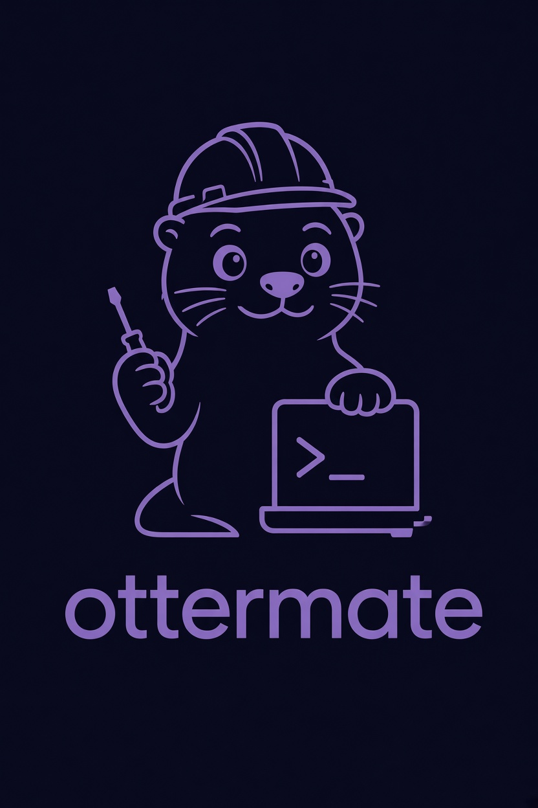

# `ottermate`: driving a running application from a shell



The user guide for `vexelray-gui-automation-cli`. The transcripts below are real runs captured against
`calculator-vexel-demo` while writing this — only the working directory in a path has been shortened to
`C:\work`. Where a run is unreliable, the transcript shows it being unreliable rather than being tidied up.

- [automation.md](automation.md) — what the socket is and why the pointer travels
- [automation-cli.md](automation-cli.md) — why the client exists, and what is still missing

---

## 1. Getting it

```bash
cd vexelray-gui && mvn -pl vexelray-gui-automation-cli install
```

The jar is executable as it stands — the module has no dependencies, so there is nothing to shade:

```bash
java -jar vexelray-gui-automation-cli/target/vexelray-gui-automation-cli-0.1.0-SNAPSHOT.jar --help
```

Worth an alias, because the rest of this guide reads much better as one word:

```bash
alias ottermate='java -jar ~/Documents/GitHub/vexelray-gui/vexelray-gui-automation-cli/target/vexelray-gui-automation-cli-0.1.0-SNAPSHOT.jar'
```

## 2. Switching the socket on

Nothing is listening unless the application was asked. It is off by default and loopback-only when on,
because it hands whoever reaches it full control of the application's input.

```bash
mvn exec:exec -Dautomation=7654     # the default port
mvn exec:exec -Dautomation=0        # a free one, announced on stdout
mvn exec:exec -Dautomation=on       # same as 7654
```

An application built on `vexelray-framework` takes `--automation=<port>` as a flag too. On binding it prints

```
automation: localhost:50845
```

which is the line `--launch` reads, and the reason `--automation=0` is safe to use for two runs at once.

---

## 3. The first five minutes

### Attach to something already running

```bash
$ ottermate shot after.png
ok C:\work\after.png 132904 bytes
```

One command, one reply, exit 0. A single command prints just its reply, so it pipes.

### Launch, drive, and shut down again

`--launch` takes **the entire rest of the line** as the command to run. It reads the port from what that
command prints, drives it, and takes it down at the end — including a `mvn` wrapper's JVM grandchild.

```bash
$ ottermate settle --launch mvn exec:exec -Dautomation=0
automation: localhost:50845
ottermate: driving localhost:50845
ok v2
```

The application's own output and `ottermate`'s own messages both go to **stderr**. Only replies go to
stdout, so `ottermate tree > tree.txt` gets a tree and nothing else.

### A conversation

With no command and no `--script`, commands come from stdin. At a terminal that is a prompt:

```
$ ottermate
ottermate> settle
ok v2
ottermate> find rail.view
ok 1
61 button "" @rail.view [25,415 38x38]
ottermate> quit
```

---

## 4. Worked examples

### Read the tree

**`settle` first.** The read-models are published by the frame loop, so a `tree` before the first frame is
honest about knowing nothing:

```
> tree
ok (no tree yet)
```

After a `settle`, the same command answers:

```
> settle
ok v2
> tree
ok v2
18 titlebar "Calculator" [0,0 1180x32]
  3 box "Calculator" [0,4 105x23]
    2 text "Calculator" [12,4 81x23]
  78 instrument-screenshot [996,0 46x32]
19 viewport "complex output · space curve  x -> (Re, Im)" @viewport [0,32 1180x688]
  38 rail [17,197 54x359]
    47 rail-item [25,205 38x38]
      46 button @rail.layers [25,205 38x38]
    62 rail-item [25,415 38x38] focused
      61 button @rail.view [25,415 38x38]
  45 rail-panel @panel [0,0 0x0] offscreen hidden
  20 textfield "e^(i*w*x/2)" @expr [56,49 238x50]
  25 text "complex output · space curve  x -> (Re, Im)" @status [22,108 358x18]
```

Read the columns as: **ref**, role, accessible name, box, then the state suffixes — `@landmark` for a node
the application named, and `clipped to [...]` / `offscreen` / `hidden` / `focused` for what is actually
pointable. Those suffixes matter: a rect says where a node was put, and `clipped to` says how much of it a
person could hit. A `45 rail-panel @panel [0,0 0x0] offscreen hidden` is a panel that is closed, not a
missing one.

### Find something, and go to it

```
> find rail.view
ok 1
61 button "" @rail.view [25,415 38x38]
> where
ok 0,0
> go rail.view
ok rail.view
> click rail.view
ok 44,434
```

`find` matches role, name or landmark, case-insensitively, and says so plainly when it matches nothing:

```
> find Save
ok (nothing matches 'Save')
```

That is an **`ok`** — a search that found nothing succeeded at searching. Only a command that could not be
carried out answers `err`.

Prefer a landmark (`@rail.view`) to a ref (`61`). Refs are stable within a run and meaningless between
runs; a landmark is what the application called the thing.

`go` is worth knowing: it uses the framework's own navigation, so a target inside a collapsed tree or a
scrolled-away row is *revealed* rather than refused. `click` on the same target does the revealing too, then
travels the pointer there and presses — `ok 44,434` is where it landed.

### A scene ladder in a file

Blank lines and `#` comments are the client's own, and never reach the application:

```bash
# panels.txt — one shot per rail panel
settle

# each click toggles the panel open, then closed again
click rail.layers
settle
shot panel-layers.png
click rail.layers

click rail.view
settle
shot panel-view.png
click rail.view
```

```bash
$ ottermate --script panels.txt
> settle
ok v2
> click rail.layers
ok 44,224
...
```

A run of several commands echoes each one above its reply, because a transcript of seven `ok` lines says
nothing about which scene each belonged to. `--quiet` drops the `ok` replies and keeps the failures.

### In a build script

The exit status is the verdict, so no output parsing:

```bash
if ottermate --quiet --script panels.txt --launch mvn exec:exec -Dautomation=0; then
    echo "scenes captured"
else
    echo "something did not answer ok"; exit 1
fi
```

| Status | Meaning | Usually |
| --- | --- | --- |
| `0` | every reply began `ok` | |
| `1` | something answered `err` | a real finding: read the reply |
| `2` | the command line | a typo; the usage is printed |
| `3` | nothing to drive | the application was not started with `--automation` |
| `4` | it went away mid-run | the application crashed — that is the finding |

A script **stops at the first `err`**, because a ladder is a sequence in which each step assumes the last
one worked: carrying on past a `click` that hit nothing leaves every later step acting on a window that is
not in the state the script assumes, and photographs it. `--keep-going` runs the rest anyway, and still
exits non-zero.

---

## 5. Three things that will bite you

### `settle` does not wait for animation — and this is the big one

`settle` waits for the frame loop to have nothing owed. It does **not** consult the clock, so an application
mid-transition with no frame currently owed answers `ok` at once. Since the calculator's rail began
animating, `click` → `settle` → `shot` therefore photographs a panel part-way through opening.

This is not theoretical. The same three-line script, run twice a minute apart:

```
> click rail.view
ok 44,434
> settle
ok v56              <- run one:  the panel is absent from the picture entirely
ok v61              <- run two:  the panel is half-faded, its buttons clipped mid-grow
```

Extra `settle`s do not help — five of them produced a **byte-identical** picture to one, because there is
nothing owed between animation ticks for `settle` to wait on.

There is no client-side workaround today, and inventing one would be worse than the gap: a `sleep` verb is
the flake this whole instrument was built to avoid. The fix is
[automation-cli.md](automation-cli.md) §5 **V3** — teaching `settle` to ask the timeline whether it is
quiescent — and until it lands, **treat a shot taken straight after an animated transition as unreliable**,
and prefer subjects that do not animate.

### `await` is for the application having finished thinking

`settle` is exact about the frame loop and blind to work still in flight on a worker: nothing is owed, so
nothing reports it. `await <landmark> <text>` waits until that landmark's accessible name contains the
text — which means an application declares readiness by *writing it down where it is legible* rather than by
a hook this tool would have to know about.

It is bounded at 30s and says so rather than hanging:

```
> await nosuchlandmark neverappears
err no landmark 'nosuchlandmark' within 30000ms; try tree
```

Note it waits on a **name**, so it cannot stand in for the animation gap above: a panel whose name does not
change as it opens is invisible to it.

### `shot` refuses to hand you a stale picture

It deletes the target first and waits for a new file to appear, so an `err` from `shot` means no picture was
taken — never that an older one is being passed off as this one:

```
> shot after.png
err no picture appeared at C:\work\after.png within 5000ms
```

Paths are the **application's**, resolved in *its* working directory, and it is a Windows JVM: a Unix-style
`/c/Users/...` from a Git Bash prompt becomes `C:\c\Users\...` and fails. Absolute paths with forward
slashes (`C:/work/after.png`) work everywhere.

---

## 6. Troubleshooting

| What you see | What it means |
| --- | --- |
| `ottermate: nothing is listening on localhost:7654; start the application with --automation=7654` | The socket is off. It is off by default |
| `ottermate: launched '...' and it did not announce a port within 60s` | The command started something, but nothing printed `automation: localhost:<port>`. Add `--automation=0` to the launched command line |
| `ottermate: launched '...' and it exited without announcing one (status 1)` | It fell over on startup. Its own output is above, on stderr |
| `err no command 'shto'; try help` | The application does not know that verb. `ottermate help` lists what it does know |
| `err IllegalArgumentException: no landmark 'x'; try tree` | The commonest real failure. The landmark is not published — `tree` shows what is |
| `err IllegalArgumentException: no node 9999` | A ref from an earlier run. Refs are per-run; address by landmark instead |
| `err cannot navigate to x: gave up after 240 frames` | `go` could not reveal it. Either it does not exist, or nothing on the way opens |
| `ottermate: the application did not finish answering 'settle' within 120s` | It stopped answering. `--timeout` raises the bound; a hang is usually the finding |
| `ottermate: the application exited on its own, status 1` | Printed after a `--launch` run where the application died before being shut down |
| `err did not settle within 2000ms (frame still owed)` | The loop never caught up — a genuine stall, and worth keeping |
| Non-ASCII coming back as `?` | Fixed: replies print as UTF-8. If your console still shows boxes, that is its font, not the reply |

---

## 7. What it deliberately does not do

- **It knows no verbs.** Commands are relayed as typed and replies printed as returned, so a verb added to
  `Automation` needs no change here. `ottermate help` asks the application.
- **It knows no applications.** `--launch` runs a command line it was handed. Knowing that this application
  is a Maven exec and that one a native binary is `mainframe`'s job if it is anyone's.
- **It has no image comparison, no recording, no replay, and no scene names.** A ladder is a script file;
  naming scenes in the client is how `--capture` grew the first time.
- **It offers no `--host`.** The server binds loopback and says the address is not configurable; a flag here
  would advertise a capability that does not exist.
